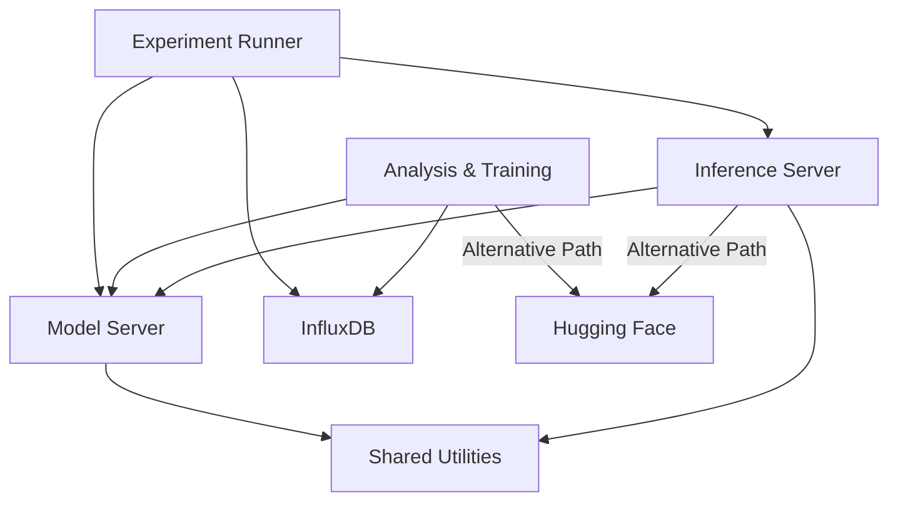

# PyTorch AI/ML Workflow

This project implements a complete AI/ML workflow using PyTorch for training and inference in a microservices architecture. It provides a modular and containerized solution for data generation, model training, model storage, and inference.

## Architecture

The project consists of the following components:



1. **Model Server** - Stores and serves trained PyTorch models converted to ONNX format
2. **Inference Server** - Provides an API for making predictions using the models
3. **Analysis and Training Environment** - Jupyter notebook environment for data analysis and model creation/training
4. **Experiment Runner** - Tool for running end-to-end tests of the workflow
5. **InfluxDB** - Time series database for storing metrics and experiment data
6. **Shared Utilities** - Common ML functions and models shared between components

## Key Features

- Complete, reproducible AI/ML workflow from data generation to inference
- Model versioning system using semantic versioning principles
- Separate model metadata storage for improved flexibility
- ONNX format for model interoperability across components
- Containerized deployment with Docker Compose
- Hybrid storage strategy supporting both local (Model Server) and cloud-based (Hugging Face) options
- Comprehensive testing infrastructure with isolated test environments
- Dynamic model input shape detection for flexible input handling
- Shared utilities module for consistent model definition and training across components

## Getting Started

### Prerequisites

- Docker and Docker Compose
- Python 3.10+
- Network connectivity between components

### Running the Services

To start all services:

```bash
sudo docker compose up -d
```

This will:
1. Build and start the model server on port 5001
2. Build and start the inference server on port 5002
3. Build and start the Jupyter notebook server on port 8888
4. Start InfluxDB for storing metrics and experiment data

**Note:** All Docker commands must be run with `sudo` due to permission requirements.

### Running Components Individually

You can also run specific components:

```bash
# Start only the model and inference servers
sudo docker compose up -d model-server inference-server

# Start the Jupyter notebook environment
sudo docker compose up -d analysis-and-training
```

## Using the Project

### Generating data with the experiment runner
You can run a test experiment with:

```bash
cd experiment-runner
./runner --config=test
```

### Training a Model

1. Access the Jupyter notebook at http://localhost:8888
2. Open `analysis-and-training/notebooks/playground.py` to use as a starting point for data analysis and model creation/training/export
3. Models are exported to ONNX format for interoperability between components
4. Model metadata is extracted and stored separately alongside the model file

### Making Predictions

Send a POST request to the inference server:

```bash
curl -X POST http://localhost:5002/inference/models/test_inference_model/latest/predict \
  -H "Content-Type: application/json" \
  -d '{"input": [[10.0], [100.0]]}'
```

You can also specify a model version:

```bash
curl -X POST http://localhost:5002/inference/models/test_inference_model/versions/1.0.0/predict \
  -H "Content-Type: application/json" \
  -d '{"input": [[10.0], [100.0]]}'
```

Or use a model UUID:

```bash
curl -X POST http://localhost:5002/inference/models/uuid/<model-uuid>/predict \
  -H "Content-Type: application/json" \
  -d '{"input": [[10.0], [100.0]]}'
```

Note: The input format is a column vector where each row is a separate input sample. The system will automatically detect the model's input shape and format data accordingly.

### Model Metadata

Metadata can be retrieved separately from the model:

```bash
curl -X GET http://localhost:5001/models/test_model/metadata
```

Or for a specific version:

```bash
curl -X GET http://localhost:5001/models/test_model/versions/1.0.0/metadata
```

### Cloud-Based Model Storage

The system supports storing and retrieving models from Hugging Face as an alternative to the local Model Server:

1. Models can be exported to Hugging Face repositories with separate metadata files
2. Inference can be performed directly from cloud-stored models
3. This approach provides flexibility for different deployment scenarios

See `analysis-and-training/notebooks/cyberpowder.py` for a complete example of the cloud storage workflow.

## Running Tests

There are several ways to run tests in this project:

### Running All Tests

To run all tests in sequence with a clean environment:

```bash
./run_all_tests.sh
```

This script will:
1. Run the model-server tests
2. Run the inference-server tests
3. Use isolated Docker volumes to prevent test interference

### Component Tests

For running tests on individual components:

```bash
# Run inference-server tests with clean environment
cd inference-server
./run_tests.sh

# Run model-server tests with clean environment
cd model-server
./run_tests.sh
```

The `run_tests.sh` scripts provide a comprehensive testing workflow that:
1. Stop existing containers
2. Remove model volumes for a clean slate
3. Start containers with fresh volumes using docker-compose.test.yml
4. Create test models using the LinearRegressionModel from playground.py
5. Run all tests with detailed output
6. Clean up test models when complete

### End-to-End Tests

You can run the end-to-end test script for workflow validation:

```bash
sudo docker compose run experiment-runner python /app/test_torch_inference.py
```

Or modify the Docker Compose configuration to run in test mode automatically:

```yaml
command: python /app/run_experiment.py --mode=test
```

## API Documentation

OpenAPI/Swagger specifications are available for both servers:

- Model Server API: http://localhost:5001/apidocs/
- Inference Server API: http://localhost:5002/apidocs/

These specifications document all available endpoints, request/response schemas, and include examples.

## Current Status

The project has a fully functional foundation with all core components implemented. Recent developments include:

- Complete ONNX integration across all components
- Separate metadata storage system for models
- Resolution of the UUID mismatch between database records and storage files
- Enhanced testing framework with clean environment setup
- Dynamic model input shape detection
- Support for cloud-based model storage via Hugging Face
- Improved Docker configuration with health checks and environment variable management
- Code simplification with shared ML utilities to reduce duplication
- Enhanced inference routes with better helper functions and organized prediction logic
- Robust module import strategies with dynamic path resolution for shared utilities
- Fixed cross-container module sharing for reliable testing and operation
- Improved test reliability with all 41 tests (24 model-server, 17 inference-server) passing consistently

Current focus areas include:
- Adding type hints to all Python code
- Refactoring and code improvements
- API definition for the aiml_xapp
- Documentation enhancements
- Further improving test reliability and flexibility
