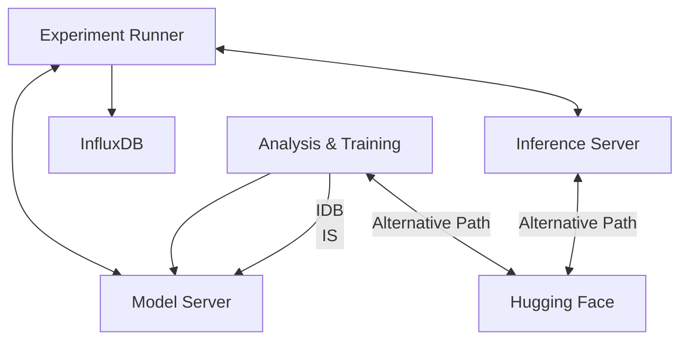

# PyTorch AI/ML Workflow

This POWDER profile implements a complete AI/ML workflow using PyTorch for training and inference in a microservices architecture orchestrated with docker compose. It provides a modular and containerized solution for data generation, model training, model storage, and inference using POWDER resources. Currently, this workflow only targets the POWDER testbed RF attenuator matrix, but will later be modularized and extended to cover other deployment environments.

## Architecture

The project consists of the following components:



1. **Experiment Runner** - Tool for running end-to-end 5G experiments to generate datasets 
3. **Analysis and Training Environment** - Jupyter notebook environment for data analysis and model creation/training
1. **Model Server** - Stores and serves trained PyTorch models exported to ONNX runtime format
2. **Inference Server** - Provides an API for making predictions using the models stored at the model server
5. **InfluxDB** - Time series database for storing metrics and experiment data
6. **Shared Utilities** - Common ML functions and models shared between components

## Key Features

- Complete, reproducible AI/ML workflow from data generation to inference
- Model versioning with metadata storage
- ONNX format for model interoperability and export
- Containerized deployment orchestrated with docker compose
- Hybrid storage strategy supporting both local (Model Server) and cloud-based (Hugging Face) options

## Getting Started

All services are run at the `ric` node in the associated experiment. The Experiment Runner is run locally in that node (not in a container) and requires SSH forwarding for controlling the other nodes in the experiment.

### Prerequisites

Prior to instantiating your experiment you need to:

1. Add your SSH public key to your POWDER account
2. Enable SSH agent forwarding for your SSH client

### Generating data with the experiment runner

Note: The experiment runner is currently designed to run a single type of experiment. I.e., one where the the slice PRB allocation and RF attenuation parameters are changed over time to generate a dataset.

Once your experiment becomes ready. Use SSH to login to the `ric` node.

You can run a short test experiment with:

```bash
cd experiment-runner
./runner --config=test
```

Or a more extended version of the same experiment with:

```bash
cd experiment-runner
./runner --config=default
```

This will:

1. Start the required services for data collection (InfluxDB and a patched version of srsRAN's OSC RIC) on the `ric` node
2. Start an Open5GS core network on the `cn5g` node with two iperf3 servers
3. Start an srsRAN monolithic CU/DU on the `cudu` node
4. Attach two COTS UEs to the network and start their iperf3 clients to generate heavy downlink traffic
5. Start the data collection xApp which subscribes to KPIs and presents a RESTFul API to get the latest KPIs and update the slice PRB ratios for the slices
6. Iterates through the attenuator settings and slice settings defined in the experiment configuration 

### Data analysis/cleaning and model creation/training/export

In an SSH session on the `ric` node:

```bash
cd /local/repository/simple-aiml-workflow
sudo docker compose up analysis-and-training
```
Note: this service depends on the model-server and inference-server services, and will start them if they are not already running.

You can now access the Jupyter notebook environment at http://localhost:8888 using the web-based VNC client provided by POWDER. Here you will find a notebook with examples for data analysis, model creation, training, and export to the model-server.

#TODO add more detailed instructions and examples including the use of the cloud-based model and dataset storage

#TODO port instructions to profile documentation

**Below is even more WIP than above**

### Running the Services

To start all services:

```bash
sudo docker compose up -d
```

This will:
1. Build and start the model server on port 5001
2. Build and start the inference server on port 5002
3. Build and start the Jupyter notebook server on port 8888
4. Start InfluxDB for storing metrics and experiment data

**Note:** All Docker commands must be run with `sudo` atm. This will be fixed in future versions.

### Running Components Individually

You can also run specific components:

```bash
# Start only the model and inference servers
sudo docker compose up -d model-server inference-server

# Start the Jupyter notebook environment
sudo docker compose up -d analysis-and-training
```

## Using the Project


### Training a Model

1. Access the Jupyter notebook at http://localhost:8888
2. Open `analysis-and-training/notebooks/playground.py` to use as a starting point for data analysis and model creation/training/export
3. Models are exported to ONNX format for interoperability between components
4. Model metadata is extracted and stored separately alongside the model file

### Model/Inference Server API examples

Currently, all services are run 

### Making Predictions

Send a POST request to the inference server:

```bash
curl -X POST http://localhost:5002/inference/models/test_inference_model/latest/predict \
  -H "Content-Type: application/json" \
  -d '{"input": [[10.0], [100.0]]}'
```

You can also specify a model version:

```bash
curl -X POST http://localhost:5002/inference/models/test_inference_model/versions/1.0.0/predict \
  -H "Content-Type: application/json" \
  -d '{"input": [[10.0], [100.0]]}'
```

Or use a model UUID:

```bash
curl -X POST http://localhost:5002/inference/models/uuid/<model-uuid>/predict \
  -H "Content-Type: application/json" \
  -d '{"input": [[10.0], [100.0]]}'
```

Note: The input format is a column vector where each row is a separate input sample. The system will automatically detect the model's input shape and format data accordingly.

### Model Metadata

Metadata can be retrieved separately from the model:

```bash
curl -X GET http://localhost:5001/models/test_model/metadata
```

Or for a specific version:

```bash
curl -X GET http://localhost:5001/models/test_model/versions/1.0.0/metadata
```

### Cloud-Based Model Storage

The system supports storing and retrieving models from Hugging Face as an alternative to the local Model Server:

1. Models can be exported to Hugging Face repositories with separate metadata files
2. Inference can be performed directly from cloud-stored models
3. This approach provides flexibility for different deployment scenarios

See `analysis-and-training/notebooks/cyberpowder.py` for a complete example of the cloud storage workflow.

## Running Tests

There are several ways to run tests in this project:

### Running All Tests

To run all tests in sequence with a clean environment:

```bash
./run_all_tests.sh
```

This script will:
1. Run the model-server tests
2. Run the inference-server tests
3. Use isolated Docker volumes to prevent test interference

### Component Tests

For running tests on individual components:

```bash
# Run inference-server tests with clean environment
cd inference-server
./run_tests.sh

# Run model-server tests with clean environment
cd model-server
./run_tests.sh
```

The `run_tests.sh` scripts provide a comprehensive testing workflow that:
1. Stop existing containers
2. Remove model volumes for a clean slate
3. Start containers with fresh volumes using docker-compose.test.yml
4. Create test models using the LinearRegressionModel from shared utilities
5. Run all tests with detailed output
6. Clean up test models when complete

### End-to-End Tests

You can run the end-to-end test script for workflow validation:

```bash
sudo docker compose run experiment-runner python /app/test_torch_inference.py
```

Or modify the Docker Compose configuration to run in test mode automatically:

```yaml
command: python /app/run_experiment.py --mode=test
```

## API Documentation

OpenAPI/Swagger specifications are available for both servers:

- Model Server API: http://localhost:5001/apidocs/
- Inference Server API: http://localhost:5002/apidocs/

These specifications document all available endpoints, request/response schemas, and include examples.
